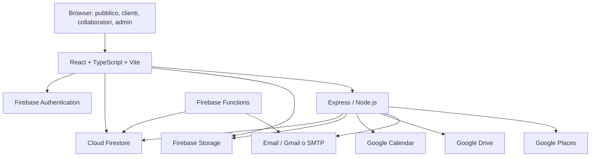

# Guida alla piattaforma Memorie Sospese

> Documento di riferimento funzionale e tecnico. Descrive il comportamento rilevato nel codice della repository al 26 agosto 2026; non sostituisce la verifica dell'ambiente pubblicato su Replit o dei dati reali in Firebase.

## Che cos'è

Memorie Sospese è la piattaforma web di **Image Studio / Gennaro Mazzacane** per il ciclo completo di un servizio fotografico, con particolare attenzione ai matrimoni. Unisce in un'unica applicazione:

- il sito pubblico e i contenuti editoriali;
- la raccolta di richieste, prenotazioni e consulenze;
- il gestionale dello studio per clienti, lavori, agenda e collaboratori;
- le gallerie private consegnate ai clienti e agli ospiti;
- preventivi, contratti, pagamenti, ricevute e fatture elettroniche;
- prodotti, fotolibri, laboratori e consegne;
- email, promemoria, backup, audit e strumenti di migrazione.

La piattaforma non è quindi un semplice sito vetrina né una sola galleria fotografica: è un gestionale operativo collegato a esperienze pubbliche e portali privati.

## Persone che usano la piattaforma

| Utente | Cosa può fare |
| --- | --- |
| Visitatore | Navigare sito, portfolio, storie, blog, video e pagine SEO; inviare richieste e prenotare una consulenza. |
| Cliente / coppia | Accedere a una galleria, scegliere foto, inviare commenti o messaggi vocali, compilare questionari, consultare preventivi e revisionare un fotolibro tramite link dedicati. |
| Ospite | Accedere al percorso ospiti/QR e, se abilitato nella galleria, partecipare con contenuti e interazioni. |
| Collaboratore | Ricevere un incarico, accettarlo o rifiutarlo e usare il proprio cruscotto tramite link con token. |
| Amministratore dello studio | Gestire tutti i dati, le configurazioni e le attività operative dal pannello protetto. |

## Percorso operativo principale

```mermaid
flowchart LR
  A[Sito pubblico] --> B[Richiesta o prenotazione]
  B --> C[Cliente e lavoro]
  C --> D[Preventivo e contratto]
  D --> E[Agenda, collaboratori e pagamenti]
  E --> F[Servizio fotografico]
  F --> G[Galleria privata]
  G --> H[Selezione, questionari e fotolibro]
  H --> I[Prodotti, laboratorio e consegna]
  I --> L[Fatture, ricevute e storico]
```



Ogni fase può essere gestita separatamente dal pannello; il diagramma mostra il flusso più frequente, non un vincolo rigido.

## Sito pubblico e contenuti

Il sito pubblico presenta lo studio e crea contatti commerciali. Le principali pagine disponibili sono:

- **Homepage**: presentazione dello studio, slideshow, recensioni e inviti all'azione.
- **Portfolio**: raccolta dei lavori, anche per categoria.
- **Experience / Storie**: contenuti narrativi e Real Wedding pubblicabili con URL dedicato.
- **Blog e video**: articoli, video matrimonio e relativi contenuti multimediali.
- **Pagina locale**: una pagina specifica per l'attività fotografica ad Aversa.
- **Accesso alla galleria**: ingresso alle gallerie consegnate ai clienti.
- **Prenotazioni e consulenze**: scelta di disponibilità e invio della richiesta.
- **Informative**: privacy, cookie policy, termini e modulo GDPR.

Portfolio, blog, video, contenuti homepage e slideshow sono gestibili dal pannello amministrativo. Le pagine Real Wedding sono esposte con slug pubblico e sono incluse nel sistema SEO e nella sitemap dinamica.

## Acquisizione contatti, agenda e consulenze

### Prenotazioni

La piattaforma raccoglie prenotazioni pubbliche e permette allo studio di gestirle dal pannello: elenco, stato, campagne e cancellazioni. Il calendario considera le disponibilità e dispone di controlli per conflitti; le attività amministrative possono anche riconciliare gli eventi con Google Calendar.

### Consulenze

Le consulenze possono essere proposte con template collegati a una tipologia di lavoro. Il visitatore sceglie uno slot dal percorso pubblico; l'amministratore può approvare, modificare, annullare, inviare promemoria e collegare la consulenza a un lavoro esistente.

### Promemoria

Il server avvia un controllo periodico degli appuntamenti e delle consulenze. I promemoria vengono inviati tramite il sistema email e sono pensati per essere idempotenti, così da non ripetere lo stesso invio.

## Gestionale dello studio

Il pannello `/admin/dashboard` è organizzato nei seguenti gruppi.

### Agenda

- calendario operativo;
- prenotazioni e campagne;
- richieste di informazioni e template per consulenze.

### Lavori e clienti

- anagrafiche clienti, cronologia e dati di contatto;
- creazione e dettaglio dei lavori/eventi;
- tipi di lavoro, provenienze e note;
- timeline operativa e stato delle attività;
- clausole contrattuali, template dei preventivi e moduli informativi;
- assegnazioni a collaboratori;
- laboratori, file di lavorazione e spedizioni/consegne.

Un lavoro è il centro operativo del servizio: può collegare clienti, data e agenda, preventivo, piano pagamenti, fatture, galleria, consulenze, collaboratori e attività di consegna.

### Cassa e documenti fiscali

- preventivi con catalogo prodotti, articoli personalizzati e template;
- invio del preventivo e portale pubblico con token;
- raccolta firma e gestione dello stato firmato;
- generazione e rimodulazione del piano pagamenti;
- registrazione di acconti e saldi;
- riepiloghi finanziari del lavoro e cassa;
- ricevute e generazione/download/eliminazione controllata di fatture XML.

### Collaboratori e catalogo

Gli incarichi possono essere inviati via email. Il collaboratore può rispondere dal link ricevuto e consultare un cruscotto personale senza esporre il pannello amministrativo completo.

Il catalogo contiene prodotti e categorie, impiegati nei preventivi e negli ordini. Sono presenti statistiche prodotto, ordini walk-in e registrazione dei pagamenti collegati agli ordini.

### Assistente studio

L'assistente operativo raccoglie suggerimenti e lavori pendenti per aiutare lo studio a seguire attività e stati di avanzamento. Le sue azioni richiedono autorizzazione amministrativa lato server.

## Gallerie e esperienza cliente

Ogni galleria è collegata a un evento e può essere privata. Il sistema mette a disposizione:

- accesso con password, PIN o flussi dedicati per gallerie speciali;
- visualizzazione responsive delle fotografie con lightbox, filtri, paginazione/caricamento progressivo e capitoli;
- miniature e strumenti di recupero/manutenzione;
- selezione delle fotografie da parte del cliente;
- commenti, like e pannello delle interazioni;
- messaggi vocali: registrazione, caricamento, ascolto e date di sblocco;
- richieste password e invio delle credenziali della galleria;
- questionari per gli sposi, con ruoli, bozze e risposte;
- pagina ospiti, utilizzabile anche tramite QR code;
- temi stagionali e personalizzazioni visive;
- condivisione controllata e statistiche delle interazioni.

Il workspace di gestione della galleria consente all'amministratore di curare foto, capitoli, impostazioni e contenuti successivi alla consegna.

## Fotolibri, laboratori e consegna

Il modulo fotolibri consente allo studio di costruire e versionare un progetto, scegliere le foto della galleria e inviare al cliente un link privato per la revisione. Dal portale il cliente può lasciare richieste di modifica o approvare la proposta. Lo studio vede le modifiche, prepara le versioni e può collegare il lavoro a una spedizione di laboratorio.

I laboratori sono gestiti come entità separate. Per le spedizioni è previsto il caricamento dei file, il tracciamento dello stato, l'invio e il costo. I file temporanei di consegne scadute sono oggetto di un controllo periodico.

## Comunicazioni, SEO e privacy

### Email

Il sistema email centralizza notifiche operative per gallerie, prenotazioni, consulenze, preventivi firmati, ordini, pagamenti, selezioni, questionari, collaboratori e richieste di recensione. Sono disponibili template email e invii puntuali, campagne email con coda e monitoraggio, pulizia dei job bloccati, storico e statistiche degli invii.

### Contenuti e SEO

L'amministratore può aggiornare portfolio, blog, video, contenuti homepage e slideshow. Il server genera una sitemap dinamica e applica prerender SEO ai crawler. I moduli pubblici basati su token ricevono invece intestazioni `noindex`, per evitare l'indicizzazione di contenuti privati.

### GDPR, backup e audit

- **GDPR**: il visitatore può inviare richieste di esportazione o cancellazione dei dati dal percorso dedicato.
- **Backup**: gli amministratori possono esportare, validare e importare backup, oltre a consultare e gestire backup su Google Drive.
- **Audit**: sono disponibili controlli di integrità, coerenza, foto orfane e discrepanze dei pagamenti; alcune correzioni sono eseguibili solo dal pannello amministrativo.
- **Migrazioni**: strumenti dedicati coprono dati legacy, date delle foto, collegamenti ai tipi di galleria, URL firmati e normalizzazione dei telefoni.

Le operazioni di importazione, migrazione, correzione massiva e ripristino sono potenzialmente impattanti: vanno eseguite da un amministratore dopo backup e validazione del risultato.

## Architettura tecnica



| Livello | Tecnologie e responsabilità |
| --- | --- |
| Frontend | React, TypeScript, Vite, Wouter, React Query, Tailwind e componenti Radix. Le sezioni principali sono caricate in modo differito. |
| API | Express/Node in `server/`; espone le API per logica riservata, integrazioni, documenti, operazioni batch e amministrazione. |
| Dati | Firebase Authentication per l'identità, Firestore per dati applicativi, Storage per fotografie e allegati. |
| Functions | Firebase Functions per notifiche email, metadati galleria, export CSV e coda email. |
| Integrazioni | Google Calendar, Google Drive, email, Google Places e generazione XML FatturaPA. |
| Pubblicazione | Codice versionato in GitHub; build ed esecuzione pubblicata tramite Replit; Firebase conserva identità, dati, file e regole. |

## Dati e sicurezza

Le principali aree Firestore sono: utenti e ruoli, impostazioni studio, gallerie/foto/commenti/messaggi vocali, accessi e richieste password, clienti, lavori, preventivi, piani pagamento, fatture, prenotazioni, consulenze, prodotti, ordini, collaboratori, moduli, fotolibri, contenuti pubblici e log operativi.

Firebase Storage ospita separatamente immagini delle gallerie e miniature, voice memo, immagini profilo, filigrane, slideshow, contenuti blog/portfolio, prodotti e allegati di lavoro. Le regole `firestore.rules` e `storage.rules` definiscono i confini di lettura e scrittura; sono parte essenziale della sicurezza della piattaforma e non vanno modificate senza un audit dedicato.

| Modalità di accesso | Uso |
| --- | --- |
| Firebase Authentication | Pannello amministrativo e API che richiedono un utente autenticato. |
| Ruolo amministratore verificato lato server | Operazioni sensibili: dati finanziari, backup, audit, migrazioni e gestione generale. |
| Token privato | Portali di preventivo, modulo informativo, fotolibro e dashboard collaboratore. |
| Password/PIN di galleria | Accesso alle gallerie condivise con clienti e ospiti. |
| Endpoint pubblico limitato | Disponibilità, richieste e pagine pubbliche; devono validare gli input e limitare gli abusi. |

Le credenziali delle integrazioni vivono nelle variabili d'ambiente di Replit o Firebase e non devono essere inserite nel repository. Fra le configurazioni attese rientrano Firebase client/admin, URL del sito, Google Calendar, Google Drive, provider email, Google Places e, dove configurata, la chiave per le funzioni AI editoriale.

## Struttura del codice

```text
client/       applicazione React, pagine, componenti, servizi e stili
server/       API Express, servizi, worker, integrazioni e middleware SEO
shared/       tipi e regole di dominio condivisi tra client e server
functions/    Firebase Functions e relativo progetto TypeScript
docs/         documentazione tecnica e decisioni di progetto
scripts/      build, verifiche, migrazioni e strumenti operativi
e2e/          test end-to-end delle gallerie
```

I tipi di dominio condivisi in `shared/` coprono, tra gli altri, lavori, clienti, pagamenti, preventivi, fatture, booking, consulenze, fotolibri, collaboratori e contenuti SEO.

## Build, pubblicazione e verifica

La configurazione Replit attuale usa:

- build: `npm run build`;
- esecuzione: `NODE_ENV=production node dist/index.js`;
- porta applicativa: `5000`.

Il comando di build esegue il bundle del server a partire da `server/index.ts` e la build Vite del client. Per questo la fonte effettiva del runtime Replit è `server/index.ts`; `server/production.ts` è un percorso storico distinto e non è il comando di avvio configurato in `.replit`.

Firebase Hosting è configurato separatamente in `firebase.json`, con rewrite per il percorso `/memoriesospese/**`. La configurazione del base path client è influenzata da `VITE_BASE_PATH`: prima di un deploy occorre verificare che hosting Firebase, build Vite, URL pubblici e Replit siano coerenti.

Per una modifica ordinaria si raccomanda:

1. analizzare il modulo, gli utenti e i dati coinvolti;
2. applicare la modifica con compatibilità per dati e link esistenti;
3. eseguire test mirati, type-check/build e controlli non interattivi;
4. controllare `git diff --check` e i file inclusi;
5. creare un commit atomico e pubblicarlo su GitHub;
6. verificare su Replit il flusso realmente interessato, senza avviare il server locale automaticamente.

## Limiti della guida e manutenzione

Questa guida descrive ciò che è implementato nella repository. Non certifica che tutte le integrazioni siano configurate nell'ambiente Replit, che le autorizzazioni Firebase siano corrette in produzione, che ogni funzionalità sia attiva per ogni galleria o cliente, né lo stato dei dati reali, dei backup e delle sincronizzazioni esterne.

Aggiornare il documento quando si aggiungono o si eliminano moduli, endpoint, integrazioni, ruoli, flussi a token, raccolte Firestore oppure procedure di build e deployment.

## Riferimenti interni

- [Mappa tecnica della piattaforma](./MAPPA-TECNICA-PIATTAFORMA.md)
- [Piano di consolidamento](./PIANO-CONSOLIDAMENTO-PIATTAFORMA.md)
- [Configurazione deployment](./DEPLOYMENT_CONFIG.md)
- [Funzionalità Studio Assistant](./STUDIO_ASSISTANT_FEATURE.md)
