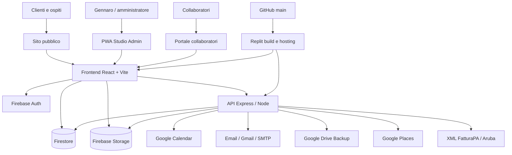
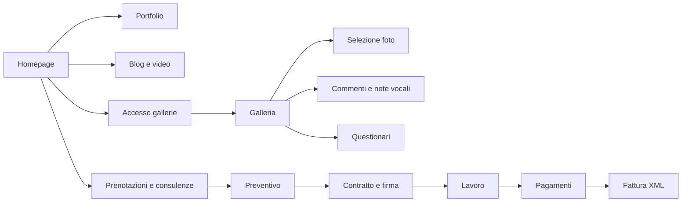
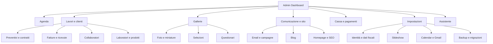
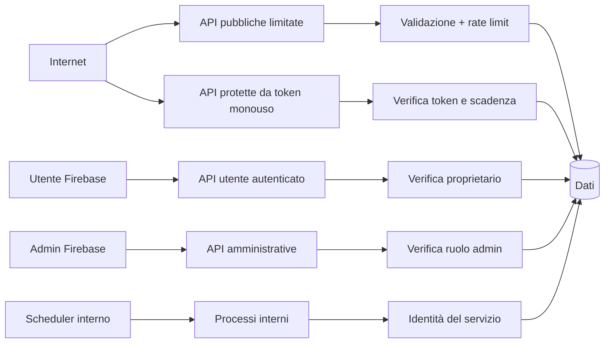
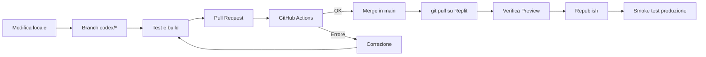

# Mappa tecnica di Memorie Sospese

> Riferimento architetturale collegato al
> [Piano di consolidamento](./PIANO-CONSOLIDAMENTO-PIATTAFORMA.md).

## Vista generale

## Esperienze utente

## Pannello amministrativo

## Gruppi API principali

| Prefisso | Responsabilità | Accesso atteso |
| --- | --- | --- |
| `/api/email` | email operative, notifiche e log | misto: pubblico controllato/admin |
| `/api/booking` | disponibilità e prenotazioni | misto: pubblico/admin |
| `/api/orders` | ordini e prodotti | admin/cliente autorizzato |
| `/api/jobs` | lavori e clienti | admin |
| `/api/payment-schedules` | scadenze e pagamenti | admin |
| `/api/quotes` | preventivi, contratti e firme | misto con token |
| `/api/import` | importazioni | admin |
| `/api/consultations` | consulenze e calendario | misto: pubblico/admin |
| `/api/calendar` | gestione Google Calendar | admin |
| `/api/receipts` | ricevute | admin |
| `/api/places` | ricerca indirizzi | pubblico limitato/admin |
| `/api/products` | catalogo prodotti | lettura pubblica/scrittura admin |
| `/api/migrations` | migrazioni dati | admin |
| `/api/admin` | manutenzione amministrativa | admin |
| `/api/galleries` | operazioni galleria | pubblico controllato/admin |
| `/api/bulk-email` | campagne email | admin |
| `/api/reminders` | promemoria | admin/scheduler |
| `/api/backup` | esportazione e ripristino | admin |
| `/api/audit` | integrità dati | admin |
| `/api/gdpr` | richieste privacy | misto controllato |
| `/api/studio-assistant` | assistente operativo | admin |
| `/api/info-forms` | moduli informativi | token/admin |
| `/api/photobooks` | revisione fotolibri | token/admin |

La colonna “Accesso atteso” è una specifica da verificare durante l'audit, non
la certificazione dello stato attuale.

## Domini dei dati

| Dominio | Entità principali | Sensibilità |
| --- | --- | --- |
| Identità | utenti, ruoli, token | alta |
| Studio | impostazioni, dati fiscali, social | media/alta |
| Clienti | anagrafica, contatti, indirizzi | alta |
| Lavori | eventi, stati, note, allegati | alta |
| Finanza | pagamenti, fatture, ricevute | molto alta |
| Gallerie | foto, password, PIN, selezioni | alta |
| Booking | richieste, disponibilità, appuntamenti | alta |
| Contratti | preventivi, firme, PDF | molto alta |
| Collaboratori | incarichi, compensi, token | alta |
| Comunicazioni | email, log, campagne | alta |
| Contenuti | homepage, portfolio, blog, video | pubblica |
| Sistema | backup, audit, lock, rate limit | molto alta |

## Confini di sicurezza

## Integrazioni esterne

| Servizio | Utilizzo | Credenziale | Rischio principale |
| --- | --- | --- | --- |
| Firebase Auth | autenticazione | configurazione Firebase | autorizzazioni incomplete |
| Firestore | database | Admin SDK/client SDK | regole troppo permissive |
| Firebase Storage | immagini e allegati | regole Storage | lettura o upload impropri |
| Google Calendar | agenda e appuntamenti | service account/OAuth | chiave scaduta o eventi duplicati |
| Gmail/SMTP | email | account/app password | invii duplicati o quota |
| Google Drive | backup | service account/OAuth | backup non ripristinabile |
| Google Places | indirizzi | API key | quota o chiave esposta |
| Aruba | import XML fatture | nessun collegamento diretto | XML non conforme |
| Replit | esecuzione e deploy | Secrets | ambienti non allineati |
| GitHub | codice e Pull Request | token GitHub | merge senza controlli |

## Flusso di pubblicazione desiderato

## Flussi critici da proteggere con test

| ID | Flusso | Priorità |
| --- | --- | --- |
| F01 | login e logout amministratore | P0 |
| F02 | creazione e modifica cliente | P1 |
| F03 | creazione e modifica lavoro | P1 |
| F04 | preventivo, firma e contratto | P1 |
| F05 | piano pagamenti, acconto e saldo | P1 |
| F06 | creazione, download ed eliminazione fattura XML | P1 |
| F07 | prenotazione e sincronizzazione Calendar | P1 |
| F08 | creazione, accesso ed eliminazione galleria | P1 |
| F09 | selezione foto e questionario cliente | P1 |
| F10 | incarico e risposta collaboratore | P1 |
| F11 | invio email e promemoria | P1 |
| F12 | backup e ripristino | P0 |
| F13 | modifica homepage e slideshow | P2 |
| F14 | installazione PWA admin | P2 |

## Punti di attenzione iniziali

Questi elementi richiedono verifica prioritaria negli emulatori e nei test:

- funzione provvisoria `hasValidToken()` nelle regole Firestore;
- lettura pubblica di risposte e bozze dei questionari;
- accesso pubblico a validation session, rate limit e distributed lock;
- distinzione tra API realmente pubbliche e operazioni amministrative;
- utilizzo del flag locale `isAdmin` solo come stato UI, mai come autorizzazione;
- documenti Firestore contenenti campi legacy o `undefined`;
- componenti molto grandi e accoppiati;
- assenza iniziale di controlli GitHub obbligatori.

## Procedura di aggiornamento della mappa

Aggiornare questo documento quando:

- viene aggiunto un gruppo API;
- nasce una nuova integrazione esterna;
- cambia il livello di accesso di una risorsa;
- viene introdotta o rimossa un'entità dati;
- cambia la procedura di pubblicazione;
- un modulo viene estratto da `AdminDashboard` o `JobDetailPage`.

Ogni aggiornamento deve indicare la Pull Request nel registro del
[piano di consolidamento](./PIANO-CONSOLIDAMENTO-PIATTAFORMA.md).
